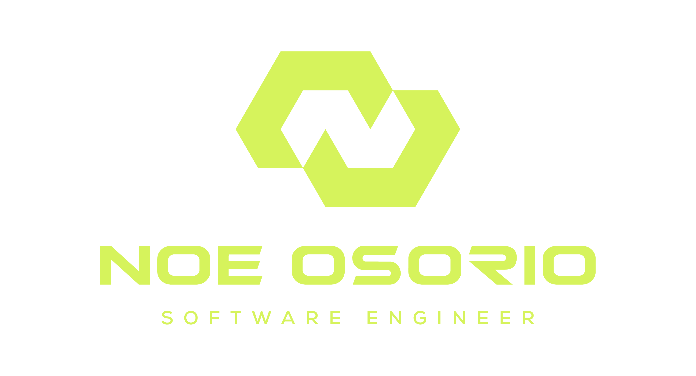

# Reto semanal de javascript
<div align="center">





</div>

Este proyecto contiene una colección de retos de JavaScript. Cada reto está organizado en su propia carpeta con la siguiente nomenclatura: `numero-nombre-del-reto`. Por ejemplo: `01-suma-digitos`.

## Retos
| Reto              | Descripción                            | Video                                |
|-------------------|----------------------------------------|--------------------------------------|
| [01-suma-digitos](01-suma-digitos) | Esta función `sumaDigitos` toma un número y devuelve la suma de sus dígitos                 | [Link al video](https://www.instagram.com/reel/C59aVveuZIM/?igsh=Y2FtcjB6ZWFlaGhn) |
| [02-temperatura](02-temperatura)   | Convertidor de temperatura: Convierte grados Celsius a Fahrenheit y viceversa.                 | [Link al video](https://www.instagram.com/reel/C6ho14hugMJ/?igsh=MWd1dTZqMzN2bDljNQ==) |
| [03-elemento-mayor](03-elemento-mayor)   | Elemento más grande: Encuentra el elemento más grande en un array.                 | [Link al video](https://www.instagram.com/reel/C6zr7OGuCjf/?igsh=NWZtMzJ0d2ZnNHBy) |
| [04-par-impar](04-par-impar)   | Número par o impar: Determina si un número es par o impar.                  | [Link al video](https://www.instagram.com/reel/C7FzHo8Bepb/?igsh=) |
| [05-primos](05-primos)   | Determina si un número es Primo o no.                 | [Link al video](https://www.instagram.com/reel/C7Su0bQoY02/?igsh=aWFuNndnaTN5aTBm) |
| [06-vocales](06-vocales)   | Cuenta las vocales de un texto e imprimelas.                | [Link al video](https://www.instagram.com/reel/C7kViL2ufPl/) |
| [07-tablas-multiplicar](07-tablas-multiplicar)   | Imprime las tablas de multiplicar.                | [Link al video](https://www.instagram.com/p/C72r7qvuZAY/) |


## Requisitos

Para poder ejecutar los retos, necesitas tener instalado Node.js en tu computadora. A continuación, te mostramos cómo instalar Node.js en diferentes sistemas operativos.

### Instalación de Node.js

#### MacOS

1. Abre la terminal.
2. Instala Homebrew si no lo tienes instalado: `/bin/bash -c "$(curl -fsSL https://raw.githubusercontent.com/Homebrew/install/HEAD/install.sh)"`
3. Una vez instalado Homebrew, ejecuta: `brew install node`

#### Windows

1. Ve a la [página oficial de Node.js](https://nodejs.org/) y descarga el instalador de Windows.
2. Ejecuta el instalador y sigue las instrucciones.

#### Linux

En distribuciones basadas en Debian (como Ubuntu):

1. Abre la terminal.
2. Ejecuta los siguientes comandos uno por uno:

    ```bash
    sudo apt update
    sudo apt install nodejs
    sudo apt install npm
    ```

En distribuciones basadas en Red Hat (como Fedora):

1. Abre la terminal.
2. Ejecuta los siguientes comandos uno por uno:

    ```bash
    sudo dnf install nodejs
    sudo dnf install npm
    ```

### Ejecución de los Retos

Cada reto se puede ejecutar ingresando a la carpeta correspondiente y ejecutando el archivo JavaScript dentro de ella. A continuación se muestra un ejemplo de cómo ejecutar un reto:

```bash
cd 01-suma-digitos
node sumaDigitos.js
```

## Autor

[noeosorio.dev](https://www.instagram.com/noeosorio.dev)


¡Disfruta resolviendo estos retos y mejorando tus habilidades en JavaScript!